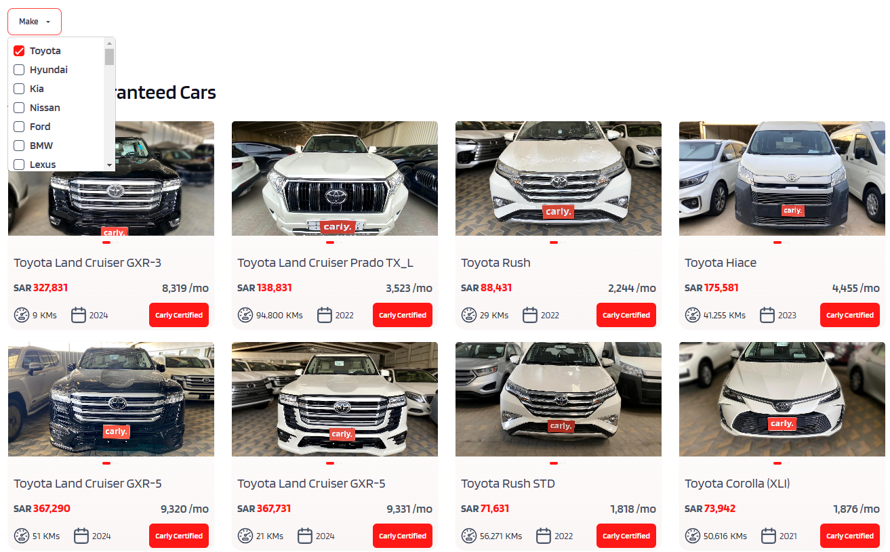

# Tasks

The final version will look like following:

- The design should as close as possible to the image above
- The cars list should be filterable by brand
- The filter dropdown should be loaded from the brands api
- Should have a loading indicator

## Apis to be used

Docs: [Swagger Documentation](http://16.171.71.132/carly-revamp-service/swagger/index.html)

- /api/Brands/all-brands
- /api/Cars/buy-cars
